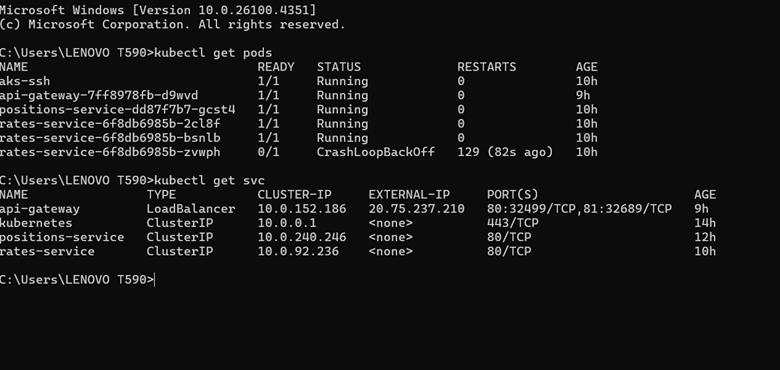

**Technical Assessment: .NET Microservices Implementation**  

You can access the live deployed microservice at:  
[**http://20.75.237.210:80/api/gateway/rateservice**](http://20.75.237.210:80/api/gateway/rateservice)

I have used the following architecture as the solution for implementing the two microservices.

Here’s a polished and professional version of your list:

**✅ Tools, Techniques, and Practices Used**

1. **Clean Architecture / Onion Architecture**  
    Ensures separation of concerns by organizing code into layers (Domain, Application, Infrastructure, API), promoting testability and maintainability.
2. **CQRS (Command Query Responsibility Segregation)**  
    Commands and queries are handled separately to improve clarity, scalability, and performance.
3. **Event-Driven Architecture**  
    Services communicate through integration events to ensure loose coupling and better scalability across microservices.
4. **Domain-Driven Design (DDD-lite)**  
    Applied core DDD concepts such as Entities, Value Objects, and Domain Events to model business logic clearly.
5. **Dependency Injection**  
    Used .NET Core’s built-in DI container to inject services and handlers, ensuring loose coupling and testability.

**Publish/Subscribe Model**

I have implemented a lightweight, in-memory event bus pattern as a basic publish/subscribe model (partially completed due to time constraints).

- Publishers raise events using Publish&lt;T&gt; ().
- Subscribers register callbacks using Subscribe&lt;T&gt; ().
- All communication is synchronous and happens within the same process.

**Proposed Technologies and Techniques**

1. A message broker such as **Azure Service Bus** or **Kafka** can be integrated for cross-process/event-driven communication. However, due to limited time, this was not implemented.
2. A **caching layer** can be introduced to improve performance and reduce external API calls.
3. **Separate databases** should be used for each microservice to follow the database-per-service pattern and ensure loose coupling.
4. **Proper containerization and orchestration** using platforms like **Kubernetes** can be applied (partially implemented in the current setup).
5. **Testing using test framework (Unit)**
6. **CICD pipelines and monitoring tools like (Prometheus, Grafana)**
7. **Scalability features (HPA), Health check probs, Taint and Tolerations, Affinity rules…etc**

**I have deployed both microservices into a Kubernetes environment, and all requests are routed through an API gateway. As a result, the Rate and Position microservices are not directly exposed to the public; external access is provided exclusively through the API gateway.**

**This architecture has been implemented in a cloud environment to simulate a real-world microservices setup. I have used API gateway to simulate the real world microservice environment.**

**I have to use Azure service bus or Kafka as the message brokers in future.**

**You can access the service via:  
**[**http://20.75.237.210:80/api/gateway/rateservice**](http://20.75.237.210:80/api/gateway/rateservice)

**Deployed microservice.**

**I can explain how I developed and implemented during the interview.**